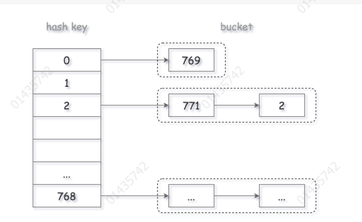

# leetcode中705题目. 设计哈希集合

## 题目 [leetcode705](https://leetcode-cn.com/problems/design-hashset/)

不使用任何内建的哈希表库设计一个哈希集合（HashSet）。

实现 MyHashSet 类：

void add(key) 向哈希集合中插入值 key 。

bool contains(key) 返回哈希集合中是否存在这个值 key 。

void remove(key) 将给定值 key 从哈希集合中删除。如果哈希集合中没有这个值，什么也不做。

示例：

输入：

["MyHashSet", "add", "add", "contains", "contains", "add", "contains", "remove", "contains"]

[[], [1], [2], [1], [3], [2], [2], [2], [2]]

输出：

[null, null, null, true, false, null, true, null, false]

解释：

MyHashSet myHashSet = new MyHashSet();

myHashSet.add(1);      // set = [1]

myHashSet.add(2);      // set = [1, 2]

myHashSet.contains(1); // 返回 True

myHashSet.contains(3); // 返回 False ，（未找到）

myHashSet.add(2);      // set = [1, 2]

myHashSet.contains(2); // 返回 True

myHashSet.remove(2);   // set = [1]

myHashSet.contains(2); // 返回 False ，（已移除）

提示：

0 <= key <= 106

最多调用 104 次 add、remove 和 contains 。

## 结题思路

用一个节点node[]数组来存储数据，实现hashset的add,contains,remove等操作。

节点node本身是一个链表，对应的key(坐标值)里可以存储多个元素，以head头节点一次记住下一个节点

对应每次要操作的元素key，先将他进行取余，取余的数就是数组下边标，这时就能确定key所在的节点node是哪个，

然后根据链表的特性来依次next查找可以

   
